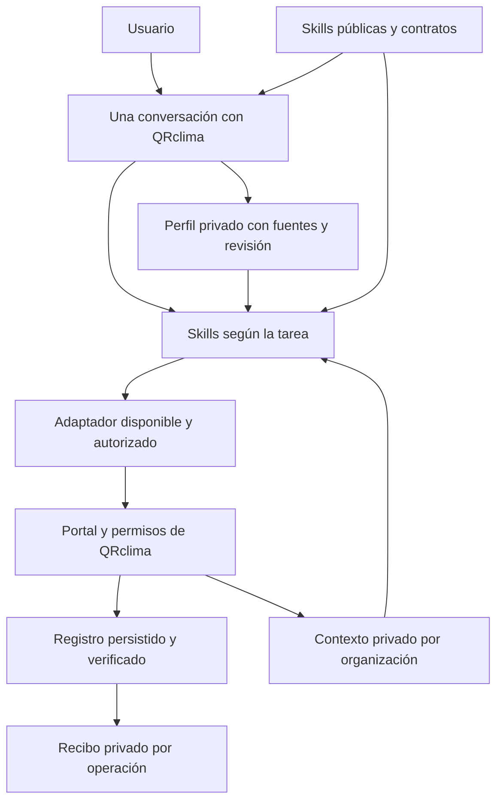
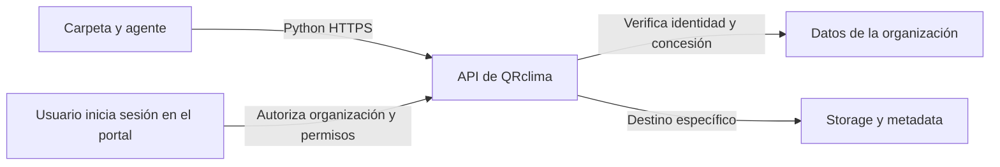

# Estructura del sistema de agentes de QRclima

El sistema distribuye instrucciones comunes y guarda configuración privada fuera del paquete instalado. Cada usuario aporta su cuenta, preferencias y accesos. QRclima conserva clientes, operaciones, permisos y resultados. El perfil local sirve para identificar el entorno y reducir preguntas repetidas; no sustituye la base de datos ni concede permisos.

## Componentes

El repositorio de desarrollo mantiene las fuentes comunes. La carpeta descargable añade entradas para distintos agentes sin duplicar procedimientos. El perfil privado contiene preferencias opcionales vacías, contexto y propuestas de mejora. El piloto y la distribución pública se generan de las mismas fuentes; sus valores personales nunca son fuentes de un ZIP.

`qrclima-mejorar-asistente` distingue global, personal, mixto y pendiente de evidencia. El mecanismo general vive en las fuentes; los valores individuales viven en el perfil. Una publicación genera un asistente nuevo sin datos del piloto, y una actualización conserva perfiles existentes. Consulta [compatibilidad](starter/COMPATIBILIDAD.md) y [contribuciones](CONTRIBUTING.md).



| Capa | Contenido | Responsable |
|---|---|---|
| Paquete público | Skills, plantillas de chats, procedimientos y esquemas | Mantenedor del paquete |
| Perfil privado | Usuario, rutas, organizaciones y conexiones declaradas o verificadas | Usuario y agente de configuración |
| Autorización humana | Operación, organización, alcance y evidencia de la instrucción | Usuario que solicita la tarea |
| Acceso real | Sesión, rol, membresía, plan y restricciones del registro | QRclima y herramientas de acceso |
| Ejecución | Navegador disponible; adaptadores adicionales cuando existan | Herramienta concreta |
| Resultado | ID, estado persistido, cobro/deuda y evidencia del caso | QRclima; el agente conserva el recibo |

Las skills guían decisiones. Las restricciones de acceso se aplican en las herramientas y en QRclima. Un archivo editable de permisos no constituye un mecanismo de seguridad ni puede otorgar acceso a otra organización.

## Agentes necesarios

Se comienza con una conversación y `qrclima-asistente`, que selecciona las skills por tarea. `qrclima-sincronizar-contexto` se encarga de conocer el negocio y mantener el índice local. Las cuatro conversaciones especializadas de la tabla son opcionales; no se requiere un orquestador que active procesos de fondo ni delegación entre chats.

| Chat | Skills | Responsabilidad y límite inicial |
|---|---|---|
| Configuración | `qrclima-configurar-perfil`, `qrclima-actualizar-perfil` | Entrevista progresiva, perfil y comprobación de conexiones; no operaciones comerciales |
| Ventas | `qrclima-capturar-venta` | Borrador y, tras habilitar el modo apropiado, registro por el portal |
| Agenda | `qrclima-planificar-cita` | Disponibilidad, borrador y registro supervisado; avisos externos deshabilitados |
| Finanzas | `qrclima-revisar-finanzas` | Lectura, explicación y detección de datos faltantes; sin pagos, borrados ni emisión fiscal |

Las plantillas de `public/agents/` se usan como mensaje inicial al crear chats. El usuario los crea o autoriza su creación. Instalar un plugin no crea por sí solo estas conversaciones.

Expedientes, inventario, CFDI y WhatsApp se agregan después como capacidades separadas, con procedimientos y pruebas propios. No se incluyen permisos de modificar código ni desplegar la aplicación.

## Perfil privado

En el proyecto descargable el agente usa explícitamente `.qrclima` dentro de la carpeta elegida. El administrador también ofrece esa ruta cuando está bajo `.agents/` en un proyecto con `AGENTS.md`. Para el plugin se conserva el orden `--root`, `QRCLIMA_AGENT_HOME`, `PLUGIN_DATA` y `.qrclima-agent` personal. El agente comunica la ubicación y la reutiliza. Los datos no se guardan en las skills ni se reemplazan al actualizar sus instrucciones.

```text
directorio-privado/
  profiles/
    alias-del-usuario/
      profile.json
      journal.jsonl
      context/
        organizacion-identificada/
          index.json
          snapshot-id.json
      receipts/
```

Un perfil puede contener varias organizaciones. Antes de una operación se vuelve a comprobar la organización seleccionada y la cuenta autenticada. Los alias no prueban identidad. Un cambio de organización invalida las lecturas comerciales de la anterior.

El piloto usa un equipo o host propio del usuario. Los alias no aíslan personas que comparten la misma cuenta del sistema operativo. Un servicio multiusuario necesitaría autenticación y almacenamiento aislado en el servidor; este administrador de archivos no implementa ese servicio.

Cada dato aprendido registra valor, estado, fuente, fecha de observación y, cuando corresponde, fecha de verificación. Los estados son `unknown`, `declared`, `verified` y `stale`.

- Una respuesta del usuario puede completar nombre, preferencia o ruta como `declared`.
- La existencia de una carpeta comprobada localmente puede ser `verified` mediante `local_check`.
- Plan, UID, rol y organización solo se verifican mediante el portal o un conector autorizado. Una etiqueta `admin` escrita en JSON no autentica al usuario.
- Una inferencia del modelo se conserva como propuesta de aprendizaje; no se convierte automáticamente en un dato verificado.
- Un dato estable, como idioma preferido, puede reutilizarse. Sesión, rol, disponibilidad, stock y precios se consultan nuevamente cuando la operación depende de ellos.

El perfil guarda configuración. La información solicitada de empresa, clientes, conceptos, citas, cotizaciones y documentos accesibles se indexa en snapshots privados por organización, con fuente, fecha y cobertura de cada lectura. `context_store.py` administra ese almacenamiento y busca registros; el navegador del agente aporta las lecturas. No es un sincronizador de red ni una copia garantizada de toda la base de datos. La [guía de carga](public/references/synchronization.md) define etapas, paginación, faltantes y documentos existentes frente a PDFs por generar.

## Primer agente y entrevista progresiva

La configuración empieza por conectar la sesión y conocer el negocio cuando ese sea el alcance solicitado. El agente reutiliza lo observado en QRclima antes de pedir nombre, organización o datos fiscales. Pregunta únicamente por lo que impida avanzar. La [guía de entrevista](public/references/onboarding.md) contiene preguntas y condiciones por etapa. El usuario envía el mensaje inicial; abrir una carpeta no inicia un agente por sí solo.

1. **Perfil básico:** tarea inicial, preferencias y ubicación del perfil.
2. **Acceso:** abrir el portal con la cuenta del usuario, comprobar organización y permisos visibles. El usuario introduce contraseñas o realiza MFA en la interfaz; no los entrega al chat.
3. **Entorno:** comprobar controlador de navegador y, si el caso necesita archivos, la carpeta seleccionada. Control remoto del teléfono es una capacidad que se comprueba aparte.
4. **Conexión opcional:** preguntar por una VM solo si el usuario quiere usar un servicio alojado allí. Guardar proveedor, host y finalidad; las credenciales permanecen en un almacén externo o sesión existente.
5. **Carga inicial:** indexar los datos accesibles del alcance pedido, con cobertura y pendientes. Si existe una primera tarea, preparar su borrador.

No es necesario conocer la estructura de Firestore, disponer de una VM ni proporcionar una llave administrativa para comenzar. En esta versión se utiliza el portal. La ausencia de VM no impide trabajar con ventas y agenda.

## Personalización y aprendizaje

El agente actualiza los datos de configuración que el usuario aporta dentro de la tarea autorizada y los resultados de verificaciones concretas. Usa `expected-revision` para evitar sobreescribir cambios de otro chat. Las actualizaciones incompatibles vuelven a leerse y se reconcilian.

Ejemplos de aprendizaje útil: carpeta de comprobantes, idioma, zona horaria, cuenta y organización seleccionadas, y capacidad de navegador observada. Preferencias comerciales y excepciones se registran como propuestas con alcance por organización; se aplican al confirmarlas el usuario. Una conversación con un cliente o el contenido de un PDF no puede modificar autorizaciones.

El diario conserva qué campos cambiaron y su revisión, sin duplicar los valores personales. El almacenamiento local es JSON sin cifrado añadido: depende de los permisos y protección del equipo. Los secretos no se guardan en estos archivos. Exportar un paquete incluye únicamente el contenido público.

## Accesos y autorizaciones

Se mantienen separados tres conceptos:

1. Una conexión existe y funciona.
2. QRclima permite al usuario la operación concreta.
3. El usuario pidió o autorizó esa operación y su alcance.

La configuración automática no implica autorización de ventas, cobros, citas o mensajes. Los modos iniciales son borradores para ventas y agenda, y lectura para finanzas. El usuario puede habilitar `confirm_each` para ventas o agenda mediante la actualización de políticas documentada. Una instrucción explícita del usuario prevalece sobre los valores de conveniencia del paquete; los permisos reales de la aplicación continúan siendo necesarios.

El registro opcional de autorizaciones locales documenta instrucciones del usuario. No firma identidades ni sustituye el control de acceso de QRclima. En esta versión el administrador de perfiles no modifica ese registro ni habilita SDK de escritura o mensajes externos.

## Contratos y resultado incierto

Cada caso tiene un ID de intento, organización, actor, entrada explícita, campos pendientes y estado. Los estados se definen en `public/schemas/operation.schema.json`. Cuando el UID no sea visible, `actor_reference` conserva la evidencia de cuenta observada sin convertirla en un UID inventado. El índice acepta `account_reference` comprobada como alternativa al UID; sigue requiriendo una organización identificada.

Una operación que pierde la respuesta después de guardar pasa a `outcome_unknown`. El `attempt_id` identifica el recibo local; esta versión no añade a QRclima un mecanismo de idempotencia. Por el portal se consulta el ID conocido o los vínculos y datos del caso antes de volver a ejecutar. Si no se puede resolver la incertidumbre, no se repite la escritura. Un recibo `verified` requiere ID persistido, lectura posterior y evidencia. No basta con que un botón haya sido pulsado o aparezca una confirmación visual.

Las herramientas futuras reciben entradas de negocio concretas, como crear una venta, y verifican permisos, totales y reintentos. No exponen consultas arbitrarias ni escrituras generales a Firestore. El SDK administrativo no conserva automáticamente la lógica del formulario ni las reglas del cliente.

## Rutas y conexiones

`paths` guarda carpetas elegidas por cada usuario. Los scripts reciben rutas como argumentos y utilizan APIs de archivos; no convierten un host, ruta o dato personal en un comando shell. Las sesiones y claves se identifican mediante referencias, sin incluir su contenido.

Las instrucciones de adaptadores están en `public/references/adapters.md`. Aquí se describe el contrato del navegador y las futuras conexiones. No hay un servidor MCP, cliente SSH ni autenticación implementados en este esqueleto.

## Fases y condición de avance

| Fase | Resultado necesario |
|---|---|
| Esqueleto local | Skills y referencias válidas; perfil inicializable, actualizaciones controladas, ZIP sin datos privados |
| Configuración real | Un usuario externo completa el perfil y verifica su propia sesión y organización |
| Primera venta | Un caso supervisado conserva conceptos, cobro, deuda y registro único |
| Agenda | Una cita respeta disponibilidad y organización; resultado persistido verificable |
| Piloto | Cinco usuarios completan tareas con poca ayuda; se mide instalación, tiempo, correcciones y repetición |
| Nuevos adaptadores | Cada conexión aporta autenticación, límites de herramientas y pruebas propias |

La prioridad es probar carpeta → chat → sesión → contexto y después una venta. El conector propio añade lectura y cambios específicos de perfil, marca y documentos; las operaciones comerciales conservan el portal. WhatsApp y facturación necesitan integración adicional.

## Referencias de formato

- [Skills de OpenAI](https://developers.openai.com/plugins/concepts/skills): separación entre procedimientos y herramientas.
- [Creación de skills](https://developers.openai.com/plugins/build/skills): instrucciones y recursos de cada tarea.
- [Paquetes de plugins](https://developers.openai.com/plugins/build/plugins): manifiesto público y componentes del paquete.


## Conexión propia por organización



El secreto local nunca aparece en el enlace del navegador. La autorización guarda su huella, UID, organización, permisos y caducidad. El servidor deriva el alcance desde esa concesión y los documentos actuales de QRclima; los archivos y skills no pueden ampliarlo. Las escrituras se ofrecen como operaciones permitidas con revisión e intento idempotente, sin acceso genérico a Firestore.

El cliente del usuario solo necesita Python y navegador para autorizar. El servidor central lo opera QRclima. [Servidor](server/README.md), [integración del portal](integration/README.md) y [contrato del conector](public/references/connector.md) describen la activación, límites y recuperación pendiente.
